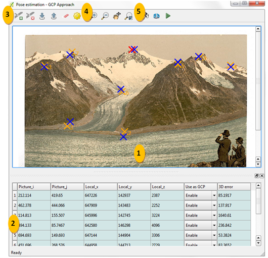
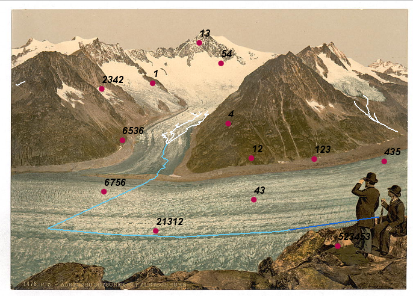

Pic2Map's documentation!
========================

This plugin was initially developed during  Gillian Milani's master thesis at EPFL in the [LASIG laboratory](http://lasig.epfl.ch). 
It is based on  *An open tool to register landscape oblique images and generate their synthetic models. 
T. Produit and D. Tuia. 
In Open Source Geospatial Research and Education Symposium (OGRS), 2012*.

The development was supported by the EPFL and the Swiss National Park.
This documentation was written by G. Milani and adapted by T. Produit.

Comments and questions can be send to: timothee.produit[at]gmail.com

February 2016

1. Concepts
========
The goal of the plugin is to provide an interaction between a picture and the map. 
Hence, the plugin has two main functionalities.

1. The orientation of the picture is computed from 3D Ground Control Points (GCP).
2. *The monoplotter* provides the interaction between the picture and the map through a Digital Elevation Model.
    * Overlay of vecor layer on the picture
    * Vector layer digitization
    * Orthorectification
   
The steps to use Pic2Map are the following:

1. Load a landscape picture and the corresponding DEM.
2. Determine the orientation of the camera with GCP (or alternatively navigate the provided 3D virtual interface or Google Earth)
3. Use the *monoplotter* to project vector data in the photograph or to project the picture on the map.

2. Installation and testing dataset
================================
You can download the plugin directly from the QGIS plugin repository.

`Plugins --> Manage ans install plugins... --> settings Tab --> Enable experimental plugins...`. 

Then, you can install the plugin by searching the plugin in the list.

The original plugin folder contains a dataset for testing the plugin. 
Copy the data outside the original folder to use it.

A technical introduction video can be found [here](https://www.youtube.com/watch?v=3Wic6PYUaKU).

3. System requirement
==================
The plugin was tested with QGIS 2.2 to 2.12, it seems to be more stable with 64bits version of QGIS.
 
OpenGL 3.0 is required for Framebuffer support. 
If Framebuffer is not supported, some tool capabilities are restricted.

You may have problem with Opengl.GL under Ubuntu. 
In this case, use the following commands and try again:

    `sudo easy_install pyopengl`

    `sudo apt-get install python python-opengl python-qt4 python-qt4-gl`

4. Data requirement
================
* An oblique picture (png, jpeg, tiff etc.)
* A DEM in tiff format 
* (An orthoimage to render the 3D image and detect GCPs)
* (Vector layer to be overlaid on the picture)

High resolution DEM and orthoimage can slow down (or crash) the plugin. 
Clip the DEM according to the image footprint and try to balance between performance and quality.

Ensure that the layers are in the **same PROJECTED Coordinate Reference System**

5. GCPs digitization
=================
GCP are similar locations clicked in the picture (2D) and in the canvas (3D). 
A minimum of 6 GCP has to be provided if no information about the camera orientation is available. 
Each GCP helps to gain precision for the camera orientation.

The GCP can be clicked in the map or in the 3D view with `ctrl + left click`. 
The 3D view ease  the recognition of similar location, but the map is better to digitize accurate GCP.

The digitization of GCP is an iterative process. 
Once that a camera orientation is obtained, the digitization of accurate GCP is facilated.

GCP can be loaded and saved as `.csv` with the  and  buttons.

The GCP digitalization interface is divided in five main areas:

1. The scene
2. The GCP table
3. The GCP toolbar
4. The scene toolbar
5. The 3D toolbar

###The Scene
It is a view of the picture.

You can select a GCP in the table and then click on the scene to provide the 2D coordinates. 

*   Zoom in the scene

*   Zoom out the scene

*   Toogle the Pan tool for the scene

*   Zoom on the selected GCP in the scene and in the canvas

###The GCP table
The two first columns record the 2D picture coordinates. 

The three next columns are the world coordinates (East, Nord and altitude). 

To fill the table, select a line and click on the scene to get image coordinates. 
Click on its correspondence in the QGIS canvas to record the world coordinates.

You can also get 3D coordinates from the 3D viewer with `ctrl + Left Click`.

The fifth column is used to enable or disable a GCP for the pose estimation. 

In the last column, you have an indication of the error. It is a measure of the distance between the 3D world coordinate of the GCP and the projection of the 2D GCP on the DEM. 

*   Create a new line in the GCP table

*   Delete the selected line in the GCP table

*   Save the GCP table

*   Load a GCP table

*   Remove the reprojected GCPs after a pose estimation

*   Change display setting of GCPs

###The 3D toolbar
*   Open the pose estimation dialog box

*   Open the 3D viewer. 

*   Close the GCP digitalization window and open the monoplotter

*   Show information contain in EXIF

*   Save current pose estimation in KML file

*   Load a pose estimation from KML file

Information about the motion in 3D viewer:

* `Left mouse button pressed`: move left-right an up-down
* `Right mouse button pressed`; rotate on the tilt and azimuth
* `Wheel`: go front and back (Press wheel for a finer placement)

Information about the capabilites in 3D viewer:

* `ctrl + Left Click`: get 3D coordinates for selected GCP
* `alt + Left Click`: fix the position of the camera at the clicked position

6. Camera Orientation
==================
The goal of the orientation is to compute the location, the orientation (azimuth, tilt, roll) and the focal of the camera (the field of view or zoom).

###Rough orientation
If the rough location of the camera is unknown, you can use the `Add --> Photo` tool of Google Earth. 
The picture orientation can be recorded as a KML and be loaded with pic2map.

###Accurate orientation
The camera orientation windows opens with a click on the  button. 
A camera parameter can be:

* **Free**: The parameter is unknown and has to be computed. If all parameters are free at least 6 GCPs are required.

* **Fixed**: The parameter is known, the other parmeters will be optimized.

* **A priori**: An approximate parameter is provided, the optimization process searches for an optimum around the provided parameters. If an *a priori* value is provided for each parameter, a solution can be computed with 4 GCPs.

Check the pose estimation by opening the 3D viewer. 
It is initialized at the computed orientation.

7. Monoplotting
============
The monplotting interface is reached with the  button.

###Vector layer overlay
A point or line layer which is visible in the map will be overlaid on the picture if the `Refresh Layers` button is clicked. 
The symbology and labels used in the canvas are reproduced in the picture. 
You can overlay simple, categorized or graduated symbology. 
However, you cannot use complex symbology, like point represented by stars or double lines representations.
You can press on `label settings` for controlling label appearance. 

 button.

###Measurements
The monoplotter can be clicked with **`Ctrl+click`**. 
You can choose to measure objects in the map plane (2D) or in 3D (on the DEM surface).

The measure tool doesn't measure in the picture directly. 
It projects the click of the mouse in the canvas. 
This implies a strange behavior: if a precise measurement is required, you have to zoom in the canvas.

###Digitization of new vector layer
The layer to be filled has to be active and in edition mode in the canvas. 
The `new feature` button is toggled. 
New points or new line vertices can be directly clicked in the picture with **`Ctrl+click`**

If you want to do precise digitization in the picture, you have to zoom at the right place in the canvas.

###Orthorectification 
Each pixel of the picture is linked to a 3D geographic coordinate. 
The orthorectification uses this information to interpolate the orthorectified picture. 
**The accuracy depends on the DEM and GCP quality. Due to the oblique geometry large errors can be observed in some regions.**

###Geographic coordinates of the pixels
The 3D geographic coordinates of each pixels can be saved as tiff images.

###Geometry analysis
This function computes the surface of a pixel which varies with the distance and the angle of incidence.

The two other plots show the angle of incidence.

This function is usefull to choose a good camera location and orientation to sense a landscape.

###Footprint
This functions generate a vector layer which contains the area sensed by the camera.

